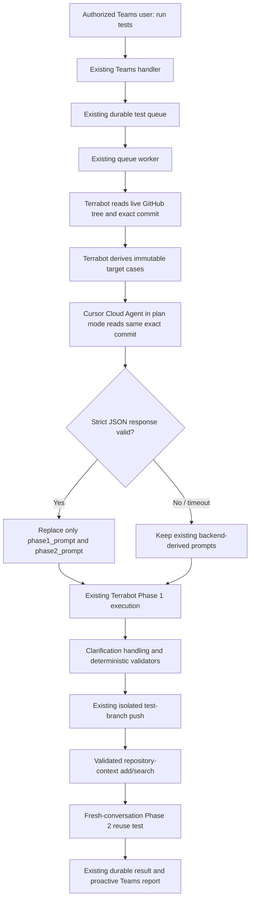

# Cursor-backed Terrabot repository-context testing

## Outcome

The production Teams command remains:

```text
run tests
run tests aws 3
run tests azure 3
run tests all 6
```

No new public HTTP Function endpoint is required. The existing Teams route, authorization check, durable queue, queue-triggered worker, test runner, validation, isolated branch push, repository-context write/retrieval, durable run state, and proactive Teams result delivery remain in place.

The only behavioral change is prompt creation: after Terrabot derives immutable live-repository test targets, the worker calls Cursor Cloud Agents to inspect the same repository at the exact commit and write Phase 1 and Phase 2 natural-language prompts.

In the current modular backend, `shared_code/terrabot_service_core.py` remains the ordered shared-namespace loader, while the existing Foundry `call_agent` hook is in `shared_code/terrabot_core_parts/10_teams_router_runtime.py`. The installer imports the primary-context module in the loader and adds one call inside that existing runtime function; it does not change `_CORE_PARTS`, replace the facade, or remove any workflow function. Older monolithic checkouts are handled by an explicit compatibility fallback.

## Runtime sequence



## Safety boundaries

Cursor receives immutable metadata for each case: repository, exact commit SHA, target path, environment, Boolean flag, current value, desired value, and evidence line. The response contract contains only `case_id`, `phase1_prompt`, and `phase2_prompt`.

The adapter rejects a response when:

- the schema version is wrong;
- the returned commit differs from the selected live commit;
- case IDs are missing, duplicated, or added;
- either prompt is empty, too long, duplicated, or not a distinct paraphrase;
- the response is not valid JSON;
- the API fails or times out.

By default, rejection is fail-open: existing backend-derived prompts are retained and the current test run continues. Set `TERRABOT_CURSOR_FAIL_OPEN=false` only when Cursor availability should be a hard requirement.

Cursor is started in **plan mode**, with `autoCreatePR=false` and `workOnCurrentBranch=false`, and receives explicit read-only instructions. It must not edit, commit, push, or create a PR. Terrabot rejects the response if the terminal run reports any pushed branch and archives the Cursor agent after the run. Terrabot remains the only component that processes prompts, generates Terraform, validates files, pushes the isolated test branch, writes repository context, and posts to Teams.

## Primary context flow

`shared_code/context/terrabot_terraform_primary_context.yaml` is loaded as opaque text so no YAML runtime dependency is added. The loader attaches it to Foundry requests as:

```json
{
  "terraform_primary_context": {
    "schema_version": "terrabot.terraform-primary-context.v1",
    "sha256": "...",
    "authority": "repository_conventions_only_live_selected_commit_wins",
    "content": "..."
  }
}
```

The same document is sent to Cursor when prompts are created. Precedence is:

1. exact live selected-commit repository evidence;
2. primary context for stable repository conventions;
3. repository-index context for validated durable hints and resolved clarifications.

## Function App logstream events

Search by the existing Terrabot `run_id` and these prefixes:

```text
[TerrabotCursor] event=cursor_prompt_generation_started
[TerrabotCursor] event=cursor_agent_created
[TerrabotCursor] event=cursor_agent_run_status
[TerrabotCursor] event=cursor_prompt_case_generated
[TerrabotCursor] event=cursor_prompt_generation_completed
[TerrabotCursor] event=cursor_agent_archived
[TerrabotCursor] event=cursor_agent_archive_failed
[TerrabotCursor] event=cursor_read_only_violation
[TerrabotCursor] event=cursor_prompt_generation_failed
[TerrabotCursor] event=cursor_prompt_fallback_used
[TerrabotContext] event=terraform_primary_context_attached
```

Each start/completion event includes the repository and exact commit. Each generated-case event includes both prompts. API keys and primary-context content are never logged.

## Apply the bundle to Terravsgithub

Run from any location, supplying the Terravsgithub repository root:

```bash
python3 /path/to/terrabot-cursor-testing-workflow/tools/apply_to_terravsgithub.py \
  /path/to/TerraVSGithub-repository-context-latest-workflow-merged \
  --check

python3 /path/to/terrabot-cursor-testing-workflow/tools/apply_to_terravsgithub.py \
  /path/to/TerraVSGithub-repository-context-latest-workflow-merged
```

The installer validates all anchors before writing, performs atomic writes, is idempotent, and refuses to patch an unexpected source layout. It does not remove or rename an existing function.

Then run:

```bash
cd /path/to/TerraVSGithub-repository-context-latest-workflow-merged
PYTHONPATH=. python3 -m unittest \
  tests.test_terraform_primary_context \
  tests.test_cursor_prompt_provider -v

python3 -m compileall -q shared_code tests
```

Run the repository's existing full test suite as well.

## Configure Cursor

Cursor Cloud Agents API v1 is currently public beta, so keep the API base URL and fail-open switch configurable and re-run the focused adapter tests when Cursor changes its API schema.

1. In the Cursor dashboard, connect the GitHub organization and authorize `venasolutions/tf-devops` and `venasolutions/tf-azure-hub` for Cloud Agents.
2. Create a service-account API key where available; otherwise create a user API key dedicated to Terrabot automation.
3. Store the key in Azure Key Vault and expose it to the Function App through a Key Vault app-setting reference.
4. Keep `TERRABOT_CURSOR_API_BASE_URL=https://api.cursor.com` for the direct Cloud Agents API. A compatible internal gateway can be used by changing only this setting.
5. No Cursor IDE session, local Cursor command, or new callback endpoint is needed. The default `TERRABOT_CURSOR_ARCHIVE_AGENT_AFTER_RUN=true` archives each durable agent after its terminal run.

Verify the key once, then confirm both repositories appear in Cursor's authorized-repository list:

```bash
curl -sS -H "Authorization: Bearer $CURSOR_API_KEY" \
  https://api.cursor.com/v1/me

curl -sS -H "Authorization: Bearer $CURSOR_API_KEY" \
  https://api.cursor.com/v1/repositories
```

The repository-list endpoint is deliberately rate-limited, so use it only for setup/diagnosis rather than on every test run. Cursor's repository integration must be able to clone the exact commit. The adapter uses `startingRef=<commit_sha>` and rejects any result that claims a different commit.

## Update the managed Foundry agent instructions

Use one of these equivalent artifacts with the existing `Intent-Terraform` agent deployment process:

- append `foundry/foundry-agent-primary-context-addendum.txt` to the current agent instructions; or
- replace the instructions with `foundry/foundry-agent-instructions-with-primary-context.txt`, which is the supplied 2026-08-31 instruction file plus that addendum.

The context body itself is not copied into the instructions. It is attached dynamically by the Function App as `terraform_primary_context`, so updating the YAML later does not require rewriting the full agent instructions.

## Configure Azure Function App settings

Copy `deployment/app-settings.example.json`, replace the Key Vault placeholder, and apply it:

```bash
az functionapp config appsettings set \
  --resource-group <RESOURCE_GROUP> \
  --name Terrabot-ai \
  --settings @deployment/app-settings.json
```

App-setting changes restart the Function App. Deploy settings during a controlled window or use your existing deployment slot/rolling strategy.

## Deploy code

Use the repository's normal production deployment pipeline. For a manual Python Functions deployment, remote build is the safest default:

```bash
func azure functionapp publish Terrabot-ai
```

This integration adds no Python package dependency; it uses the existing `requests` dependency and Python standard library.

Before production invocation, confirm:

```bash
az functionapp config appsettings list \
  --resource-group <RESOURCE_GROUP> \
  --name Terrabot-ai \
  --query "[?starts_with(name, 'TERRABOT_CURSOR_') || starts_with(name, 'TERRABOT_TERRAFORM_PRIMARY_CONTEXT_')].name"
```

Do not print the API-key value into shell history or deployment logs.

## Production verification

From the authorized Teams conversation, send:

```text
run tests all 2
```

First verify a small run, then use the normal six-case command. Expected log order:

```text
test_run_worker_started
repository_cases_derived
cursor_prompt_generation_started
cursor_agent_created
cursor_agent_run_status ... FINISHED
cursor_prompt_case_generated
cursor_prompt_generation_completed
test_case_started
...
test_run_worker_completed
```

The existing worker should then proactively post the final test table to the same Teams conversation.

## Rollback

Fast runtime rollback, without code deployment:

```bash
az functionapp config appsettings set \
  --resource-group <RESOURCE_GROUP> \
  --name Terrabot-ai \
  --settings TERRABOT_CURSOR_PROMPT_GENERATION_ENABLED=false
```

With Cursor disabled, `run tests` immediately uses the pre-existing backend prompt builder. The primary context can be independently disabled with `TERRABOT_TERRAFORM_PRIMARY_CONTEXT_ENABLED=false`.
